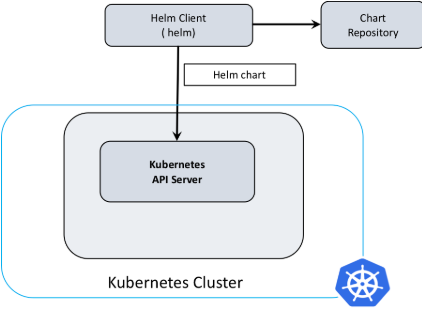

# Introduction to Helm, the package manager for Kubernetes
---
- [# Introduction to Helm, the package manager for Kubernetes](#-introduction-to-helm-the-package-manager-for-kubernetes)
- [Introduction to Helm](#introduction-to-helm)
- [Helm 3,  an important architectural change](#helm-3--an-important-architectural-change)
- [Installing Helm](#installing-helm)
    - [From the Binary Releases](#from-the-binary-releases)
    - [From Homebrew (macOS)](#from-homebrew-macos)
    - [From Chocolatey (Windows)](#from-chocolatey-windows)
- [Getting started with Helm 3](#getting-started-with-helm-3)
  - [Initialize Helm Charts](#initialize-helm-charts)
  - [Helm search: Finding charts](#helm-search-finding-charts)
  - [Helm install: Installing a package](#helm-install-installing-a-package)
  - [Customizing the Chart Before Installing](#customizing-the-chart-before-installing)
- [A litte guide to Helm Charts](#a-litte-guide-to-helm-charts)
  - [Charts](#charts)
    - [A Starter Chart](#a-starter-chart)
      - [A Quick Glimpse of `mychart/templates/`](#a-quick-glimpse-of-mycharttemplates)
      - [A first template](#a-first-template)
      - [Adding a Simple Template Call](#adding-a-simple-template-call)
  - [Applications](#applications)
    - [Install tomcat using Helm 3 by pullin locally its Chart](#install-tomcat-using-helm-3-by-pullin-locally-its-chart)
    - [Install Mysql](#install-mysql)
    - [Install Metrics-server](#install-metrics-server)


## Introduction to Helm
Deploying applications to Kubernetes can be complex. Setting up a single application can involve creating multiple interdependent Kubernetes resources – such as pods, services, deployments, and replicasets – each requiring you to write a detailed YAML manifest file.

Helm is a **package manager for Kubernetes** that allows developers and operators to more easily package, configure, and deploy applications and services onto Kubernetes clusters.

Helm is now an official Kubernetes project and is part of the Cloud Native Computing Foundation (CNCF), a non-profit that supports open source projects in and around the Kubernetes ecosystem.

Helm can:
* Install software.
* Automatically install software dependencies.
* Upgrade software.
* Configure software deployments.
* Fetch software packages from repositories.

## Helm 3,  an important architectural change
The version 3 of Helm, released in November 2019, is a complete re-architecture based on community best practices and with a big focus on security. 
Helm 3 has brough an important architectural change :  In the previous version Helm 2 was a client-server architecture with the client called **helm** and the server called **Tiller**.  Helm 3 has a client-only architecture with the client still called helm. As seen in the following diagram, it operates similar to the Helm 2 client, but the client interacts directly with the Kubernetes API server. The in-cluster server Tiller is now removed.


The main benefit of removing Tiller is that security is now on a per-user basis. It is delegated to Kubernetes user cluster security. Access to the cluster using Helm 3 is similar to kubectl.
A welcome side effect of removing Tiller is that initializing Helm is obsolete in version 3. In other words, helm init was removed and you don't need to install Tiller in the cluster and set up a Helm state before using it. A Helm state is created automatically when required.

## Installing Helm
Helm can be installed either from source, or from pre-built binary releases.

#### From the Binary Releases

Every release of Helm provides binary releases for a variety of OSes. These binary versions can be manually downloaded and installed.
     
1. Download your [desired version](https://github.com/helm/helm/releases)
2. Unpack it (`tar -zxvf helm-v3.0.0-linux-amd64.tar.gz`)
3. Find the `helm` binary in the unpacked directory, and move it to its desired destination (`mv linux-amd64/helm /usr/local/bin/helm`)
From there, you should be able to run the client and add the stable repo: helm help.

####  From Homebrew (macOS)
Members of the Kubernetes community have contributed a Helm formula build to Homebrew. This formula is generally up to date.

```shell
brew install helm
(Note: There is also a formula for emacs-helm, which is a different project.)
```
#### From Chocolatey (Windows)
Members of the Kubernetes community have contributed a Helm package build to Chocolatey. This package is generally up to date.
```
choco install kubernetes-helm
```
A manual installation is also possible, by just (1) downloading Helm.exe and  (2) adding its path entry in the global System PATH variable.
To test the installation of Helm, typ in
```
help version 
```

## Getting started with Helm 3

Let's understand the basics of using Helm to manage packages on your Kubernetes cluster. There are three basic concepts to understand.
1. **A Chart** is a Helm package. It contains all of the resource definitions necessary to run an application, tool, or service inside of a Kubernetes cluster. Think of it like the Kubernetes equivalent of a Homebrew formula, an Apt dpkg, or a Yum RPM file.
2. A **Repository** is the place where charts can be collected and shared. It’s like Perl’s CPAN archive or the Fedora Package Database, but for Kubernetes packages.
3. A **Release** is an instance of a chart running in a Kubernetes cluster. One chart can often be installed many times into the same cluster. And each time it is installed, a new release is created. Consider a MySQL chart. If you want two databases running in your cluster, you can install that chart twice. Each one will have its own release, which will in turn have its own release name.

With these concepts in mind, we can now explain Helm like this:

> Helm installs **charts** into Kubernetes, creating a new **release** for each installation. And to find new charts, you can search Helm chart **repositories**.

### Initialize Helm Charts

Charts are the packaging format used in Helm. A Chart is a collection of multiple files, folders, and templates to define multiple Kubernetes resources. Templates are the Kubernetes resource definitions and you can use the same chart for multiple different releases by injecting your dynamic values to the template. 

You can initialize the Helm chart repository with the official Helm chart repository or with any other repository by adding various Helm chart repository available:

```shell
$ helm repo add stable https://charts.helm.sh/stable
```

You can update the above repo for changes by using:

```shell
$ helm repo update
```
You can list down all the stable charts available in above repository by using below command, you can use any chart from them as base chart:


```shell
$ helm search repo stable
```

### Helm search: Finding charts
Helm comes with a powerful search command. It can be used to search two different types of source:

- `helm search hub `searches the Helm Hub, which comprises helm charts from dozens of different repositories.
- `helm search repo `searches the repositories that you have added to your local helm client (with helm repo add). This search is done over local data, and no public network connection is needed.
You can find publicly available charts by running helm search hub:
You can find publicly available charts by running helm search hub:

```shell
$ helm search hub wordpress
```
The above searches for all wordpress charts on Helm Hub.
With no filter, helm search hub shows you all of the available charts. 

Using `helm search repo`, you can find the names of the charts in repositories you have already added:
```shell
$ helm repo add brigade https://brigadecore.github.io/charts
```
Helm search uses a fuzzy string matching algorithm, so you can type parts of words or phrases:

```shell
$ helm search repo kash
```
Search is a good way to find available packages. Once you have found a package you want to install, you can use helm install to install it.

### Helm install: Installing a package
To install a new package, use the helm install command. At its simplest, it takes two arguments: A release name that you pick, and the name of the chart you want to install.

```shell
$ helm install happy-panda stable/mariadb
Fetched stable/mariadb-0.3.0 to /Users/mattbutcher/Code/Go/src/helm.sh/helm/mariadb-0.3.0.tgz
happy-panda
Last Deployed: Wed Sep 28 12:32:28 2016
Namespace: default
Status: DEPLOYED
```
Now the mariadb chart is installed. Note that installing a chart creates a new release object. The release above is named happy-panda. (If you want Helm to generate a name for you, leave off the release name and use --generate-name.)

During installation, the helm client will print useful information about which resources were created, what the state of the release is, and also whether there are additional configuration steps you can or should take.

Helm does not wait until all of the resources are running before it exits. Many charts require Docker images that are over 600M in size, and may take a long time to install into the cluster.

To keep track of a release’s state, or to re-read configuration information, you can use `helm status`:

```shell
$ helm status happy-panda
```

### Customizing the Chart Before Installing
Installing the way we have here will only use the default configuration options for this chart. Many times, you will want to customize the chart to use your preferred configuration.

To see what options are configurable on a chart, use `helm show values`:

```shell
$ helm show values stable/mariadb
Fetched stable/mariadb-0.3.0.tgz to /Users/mattbutcher/Code/Go/src/helm.sh/helm/mariadb-0.3.0.tgz
## Bitnami MariaDB image version
## ref: https://hub.docker.com/r/bitnami/mariadb/tags/
##
## Default: none
imageTag: 10.1.14-r3

## Specify a imagePullPolicy
## Default to 'Always' if imageTag is 'latest', else set to 'IfNotPresent'
## ref: https://kubernetes.io/docs/user-guide/images/#pre-pulling-images
##
# imagePullPolicy:

## Specify password for root user
## ref: https://github.com/bitnami/bitnami-docker-mariadb/blob/master/README.md#setting-the-root-password-on-first-run
##
# mariadbRootPassword:

## Create a database user
## ref: https://github.com/bitnami/bitnami-docker-mariadb/blob/master/README.md#creating-a-database-user-on-first-run
##
# mariadbUser:
# mariadbPassword:

## Create a database
## ref: https://github.com/bitnami/bitnami-docker-mariadb/blob/master/README.md#creating-a-database-on-first-run
##
# mariadbDatabase:
# ...
```
You can then override any of these settings in a YAML formatted file, and then pass that file during installation.

```shell
$ echo '{mariadbUser: user0, mariadbDatabase: user0db}' > config.yaml
$ helm install -f config.yaml stable/mariadb --generate-name
```
The above will create a default MariaDB user with the name user0, and grant this user access to a newly created user0db database, but will accept all the rest of the defaults for that chart.

## A litte guide to Helm Charts

In this section of the guide, we’ll create a chart and then add a first template. The chart we created here will be used throughout the rest of the guide.

To get going, let’s take a brief look at a Helm chart.

### Charts
As described in the [Charts Guide](https://helm.sh/docs/topics/charts), Helm charts are structured like this:

```shell
mychart/
  Chart.yaml
  values.yaml
  charts/
  templates/
  ...
```
The `templates/` directory is for template files. When Helm evaluates a chart, it will send all of the files in the `templates/` directory through the template rendering engine. It then collects the results of those templates and sends them on to Kubernetes.

The `values.yaml` file is also important to templates. This file contains the default values for a chart. These values may be overridden by users during `helm install ` or `helm upgrade`.

The `Chart.yaml` file contains a description of the chart. You can access it from within a template. The `charts/` directory may contain other charts (which we call subcharts). Later in this guide we will see how those work when it comes to template rendering.

#### A Starter Chart 
For this guide, we'll create a simple chart called `mychart`, and then we'll create some templates inside of the chart.

```shell
$ helm create mychart
Creating mychart
```
From here on, we'll be working in the `mychart` directory.

##### A Quick Glimpse of `mychart/templates/`
If you take a look at the mychart/templates/ directory, you'll notice a few files already there.

- `NOTES.txt`: The ''help text'' for your chart. This will be displayed to your users when they run helm install.
- `deployment.yaml`: A basic manifest for creating a Kubernetes deployment
- `service.yaml`: A basic manifest for creating a service endpoint for your deployment
- `_helpers.tpl`: A place to put template helpers that you can re-use throughout the chart
And what we're going to do is… remove them all! That way we can work through our tutorial from scratch. We'll actually create our own NOTES.txt and _helpers.tpl as we go.

```shell
$ rm -rf mychart/templates/*
```
When you're writing production grade charts, having basic versions of these charts can be really useful. So in your day-to-day chart authoring, you probably won't want to remove them.

#####  A first template
The first template we are going to create will be a `ConfigMap`. In Kubernetes, a ConfigMap is simply a container for storing configuration data. Other things, like pods, can access the data in a ConfigMap.

Because ConfigMaps are basic resources, they make a great starting point for us.

Let's begin by creating a file called mychart/templates/configmap.yaml:

```yaml
apiVersion: v1
kind: ConfigMap
metadata:
  name: mychart-configmap
data:
  myvalue: "Hello World"

```
**TIP**: Template names do not follow a rigid naming pattern. However, we recommend using the suffix `.yaml` for YAML files and `.tpl` for helpers.

The YAML file above is a bare-bones ConfigMap, having the minimal necessary fields. In virtue of the fact that this file is in the `templates/` directory, it will be sent through the template engine.

It is just fine to put a plain YAML file like this in the `templates/` directory. When Helm reads this template, it will simply send it to Kubernetes as-is.

With this simple template, we now have an installable chart. And we can install it like this:

```shell
$ helm install full-coral ./mychart
NAME: full-coral
LAST DEPLOYED: Tue Nov  1 17:36:01 2016
NAMESPACE: default
STATUS: DEPLOYED

RESOURCES:
==> v1/ConfigMap
NAME                DATA      AGE
mychart-configmap   1         1m
```
In the output above, we can see that our ConfigMap was created. Using Helm, we can retrieve the release and see the actual template that was loaded.

```shell
$ helm get manifest full-coral
```
```yaml
---
# Source: mychart/templates/configmap.yaml
apiVersion: v1
kind: ConfigMap
metadata:
  name: mychart-configmap
data:
  myvalue: "Hello World"
```

The `helm get manifest` command takes a release name (`full-coral`) and prints out all of the Kubernetes resources that were uploaded to the server. Each file begins with `---` to indicate the start of a YAML document, and then is followed by an automatically generated comment line that tells us what template file generated this YAML document.


From there on, we can see that the YAML data is exactly what we put in our `configmap.yaml` file.

Now we can uninstall our release: `helm uninstall full-coral`.

##### Adding a Simple Template Call
Hard-coding the `name:` into a resource is usually considered to be bad practice. Names should be unique to a release. So we might want to generate a name field by inserting the release name.

**TIP**: The `name:` field is limited to 63 characters because of limitations to the DNS system. For that reason, release names are limited to 53 characters. Kubernetes 1.3 and earlier limited to only 24 characters (thus 14 character names).

Let’s alter `configmap.yaml `accordingly.

```yaml
apiVersion: v1
kind: ConfigMap
metadata:
  name: {{ .Release.Name }}-configmap
data:
  myvalue: "Hello World"
```
The big change comes in the value of the `name:` field, which is now `{{ .Release.Name }}-configmap`.

 > A template directive is enclosed in `{{ `and `}} `blocks.

The template directive `{{ .Release.Name }}` injects the release name into the template. The values that are passed into a template can be thought of as namespaced objects, where a dot (`.`) separates each namespaced element.

The leading dot before `Release` indicates that we start with the top-most namespace for this scope (we’ll talk about scope in a bit). So we could read `.Release.Name` as “start at the top namespace, find the `Release` object, then look inside of it for an object called `Name`”.

The `Release` object is one of the built-in objects for Helm, and we’ll cover it in more depth later. But for now, it is sufficient to say that this will display the release name that the library assigns to our release.

Now when we install our resource, we’ll immediately see the result of using this template directive:

```shell
$ helm install clunky-serval ./mychart
NAME: clunky-serval
LAST DEPLOYED: Tue Nov  1 17:45:37 2016
NAMESPACE: default
STATUS: DEPLOYED

RESOURCES:
==> v1/ConfigMap
NAME                      DATA      AGE
clunky-serval-configmap   1         1m
```
Note that in the `RESOURCES` section, the name we see there is `clunky-serval-configmap` instead of `mychart-configmap`.

You can run `helm get manifest clunky-serval` to see the entire generated YAML.

At this point, we’ve seen templates at their most basic: YAML files that have template directives embedded in `{{` and `}}`. In the next part, we’ll take a deeper look into templates. But before moving on, there’s one quick trick that can make building templates faster: When you want to test the template rendering, but not actually install anything, you can use h`elm install --debug --dry-run goodly-guppy ./mychart` . This will render the templates. But instead of installing the chart, it will return the rendered template to you so you can see the output:

```yaml
$ helm install --debug --dry-run goodly-guppy ./mychart
install.go:149: [debug] Original chart version: ""
install.go:166: [debug] CHART PATH: /Users/ninja/mychart

NAME: goodly-guppy
LAST DEPLOYED: Thu Dec 26 17:24:13 2019
NAMESPACE: default
STATUS: pending-install
REVISION: 1
TEST SUITE: None
USER-SUPPLIED VALUES:
{}

COMPUTED VALUES:
affinity: {}
fullnameOverride: ""
image:
  pullPolicy: IfNotPresent
  repository: nginx
imagePullSecrets: []
ingress:
  annotations: {}
  enabled: false
  hosts:
  - host: chart-example.local
    paths: []
  tls: []
nameOverride: ""
nodeSelector: {}
podSecurityContext: {}
replicaCount: 1
resources: {}
securityContext: {}
service:
  port: 80
  type: ClusterIP
serviceAccount:
  create: true
  name: null
tolerations: []

HOOKS:
MANIFEST:
---
# Source: mychart/templates/configmap.yaml
apiVersion: v1
kind: ConfigMap
metadata:
  name: goodly-guppy-configmap
data:
  myvalue: "Hello World"
```
Using `--dry-run` will make it easier to test your code, but it won’t ensure that Kubernetes itself will accept the templates you generate. It’s best not to assume that your chart will install just because `--dry-run` works.

In this Helm Template Guide, we take the basic chart we defined here and explore the Helm template language in detail. And we'l get started with built-in objects.


### Applications

#### Install tomcat using Helm 3 by pullin locally its Chart

- Add Kubernetes charts repo to the local repos 
```shell
helm repo add stable https://kubernetes-charts.storage.googleapis.com/
helm repo update
```
- Search for Tomcat chart
```shell
 helm search repo tomcat  
```

- Navigate to your local Filesystem and create the folder where yan want to pull the chart (let's suppose it the  `tmp` folder)

- Pull and untar the chart

```shell
helm pull stable/tomcat --untar
```

- Modify the values if you want, then install the chart
  
```shell
  helm install my-tomcat  .
```

- Uninstall  
```shell
  helm uninstall my-tomcat  
```

#### Install Mysql

- Search for MySQL chart
```shell
 helm search repo mysql  
```
- Show the values

```shell
helm show values stable/mysql
```
- Install the chart
```
helm install  my-mysql --set mysqlPassword=admin,mysqlUser=admin stable/mysql
```

- Unistall the chart
  
  - Install the chart
```
helm uninstall  my-mysql
```

#### Install Metrics-server

- If Metric-server is not installed, the followin top doaes not work. we will recheck it once Metrics-server is installed.
  
  ```shell
  kubectl top nodes
  ```
- Add Kubernetes charts repo to the local repos
   
  ```shell
  helm repo add stable https://kubernetes-charts.storage.googleapis.com/
  helm repo update
  ```

- List the repos

  ```shell
  helm repo list
  ```
- Search for the chart
  
  ```
  helm search repo metrics-server
  ```
- Save localally the values

  ```shell
  helm show values stable/metrics-server  >my-metrics.values
  ```
Open `my-metrics.values` and perform  the following two changes:

  1-Change hostNetwork enabled to **true**

    ```shell
    > hostNetwork 
        change enabled : true 
    ```
  2- Activate `kubelet-insecure-tls`
  args Remove empty brackets [] and uncomment `kubelet-insecure-tls` line

    ```shell
    - -- kubelet-insecure-tls
    ```	

- Install the metrics-servicer using the updated values

  ```shell
  helm install my-metrics-server stable/metrics-server --values my-metrics.values
  ```

- Check that metrics server is running by issuing 

  ```shell
  kubectl top nodes
  ```