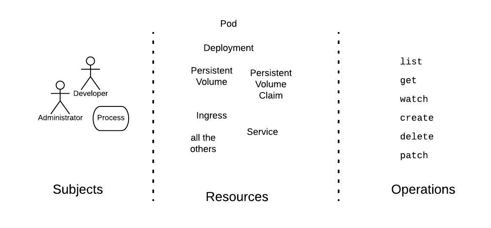

# Lab 7 - Controlling Access to Resources in Kubernetes
---


### Lab Steps
- [Step 1. Understanding Kubernetes RBAC model](#step-1-understanding-kubernetes-rbac-model)
- [Step 2. RBAC: Create user with limited namespace access](#step-2-rbac-create-user-with-limited-namespace-access)
  - [Task 1. Create the office namespace](#task-1-create-the-office-namespace)
  - [Task 2. Create the user credentials](#task-2-create-the-user-credentials)
  - [Task 3: Create the role for managing deployments](#task-3-create-the-role-for-managing-deployments)
  - [Task 4: Bind the role to the maxime user](#task-4-bind-the-role-to-the-maxime-user)
- [Step 3. Implementing a Network Policy](#step-3-implementing-a-network-policy)
  - [LIMIT traffic to an application](#limit-traffic-to-an-application)
    - [Example](#example)
    - [Try it out](#try-it-out)
    - [Cleanup](#cleanup)

<div style="page-break-after: always"></div>


This lab will go through the basic Kubernetes Role-Based Access Control (RBAC) API Objects, together with a common use cases : create a user with limited access. RBAC policies are vital for the correct management of your cluster, as they allow you to specify which types of actions are permitted depending on the user and their role in your organization. Examples include:

- Secure your cluster by granting privileged operations (accessing secrets, for example) only to admin users.
- Force user authentication in your cluster.
- Limit resource creation (such as pods, persistent volumes, deployments) to specific namespaces. You can also use quotas to ensure that resource usage is limited and under control.
- Have a user only see resources in their authorized namespace. This allows you to isolate resources within your organization (for example, between departments).

# Step 1. Understanding Kubernetes RBAC model
In order to fully grasp the idea of RBAC, we must understand that three elements are involved:

- **Subjects**: The set of users and processes that want to access the Kubernetes API. These correspond to the entity that attempts an operation in the cluster. There are three types of subjects:
   - User Accounts: These are global, and meant for humans or processes living outside the cluster. There is no associated resource API Object in the Kubernetes cluster.
   - Service Accounts: This kind of account is namespaced and meant for intra-cluster processes running inside pods, which want to authenticate against the API.
   - Groups: This is used for referring to multiple accounts. There are some groups created by default such as cluster-admin (explained in later sections).
- **Resources**: The set of Kubernetes API Objects available in the cluster. Examples include Pods, Deployments, Services, Nodes, and PersistentVolumes, among others. At a higher level, resources are associated with [API Groups](https://kubernetes.io/docs/concepts/overview/kubernetes-api/#api-groups) (for example, Pods belong to the core API group whereas Deployments belong to the apps API group). 

  One basic Kubernetes feature is that all its resources are modeled API objects, which allow CRUD (Create, Read, Update, Delete) operations.
- **Verbs**: The set of operations that can be executed to the resources above. Different verbs are available (examples: `get`, `create`, `delete`,`watch`, `list`, etc.). 
 
With these three elements in mind, the key idea of RBAC is the following:

   _We want to connect subjects, API resources, and operations. In other words, we want to specify, given a user, which operations can be executed over a set of resources._

The [figure below](https://github.com/reselbob/k8sassets/blob/master/rbac/images/RBAC-items.jpeg) [Credit to Bob Reseman] illustrates the RBAC model.
 

# Step 2. RBAC: Create user with limited namespace access
In this example, we will create the following User Account:

- Username: `maxime`
- Group: `businesstraining`

We will add the necessary RBAC policies so this user can fully manage deployments (i.e. use kubectl run command) only inside the `office` namespace. At the end, we will test the policies to make sure they work as expected.

## Task 1. Create the office namespace
Execute the kubectl create command to create the namespace (as the admin user):

```shell
kubectl create namespace office
```
## Task 2. Create the user credentials
Kubernetes does not have API Objects for User Accounts. Of the available ways to manage authentication (see Kubernetes official documentation for a complete list, we will use OpenSSL certificates for their simplicity. The necessary steps are:

- Create a private key for your user. In this example, we will name the file `maxime.key`:

  ```shell
  openssl genrsa -out maxime.key 2048
  ```

- Create a certificate sign request `maxime.csr` using the private key you just created (`maxime.key` in this example). Make sure you specify your username and group in the -subj section (CN is for the username and O for the group). As previously mentioned, we will use `maxime` as the name and `businesstraining` as the group:

  ```shell
  openssl req -new -key maxime.key -out maxime.csr -subj "/CN=maxime/O=businesstraining"
  ```

- Locate your Kubernetes cluster certificate authority (CA). This will be responsible for approving the request and generating the necessary certificate to access the cluster API. Its location in the case of Minikube is `~/.minikube/`. In the case of Docker Desktop Kubernetes, they are not mounted locally. Use the following `kubectl cp` command to get the certificate:

  ```shell
  kubectl cp kube-apiserver-docker-desktop:run/config/pki/ca.crt -n kube-system /tmp/ca.crt
  ```
- Generate the final certificate `maxime.crt` by approving the certificate sign request, `maxime.csr`, you made earlier. Make sure you substitute the CA_LOCATION placeholder with the location of your cluster CA. In this example, the certificate will be valid for 500 days:

  ```shell
  openssl x509 -req -in maxime.csr -CA CA_LOCATION/ca.crt -CAkey CA_LOCATION/ca.key -CAcreateserial -out maxime.crt -days 500
  # In case of Minikube change CA_LOCATION with $HOME/.minikube
  ```
- Save both `maxime.crt` and `maxime.key` in a safe location (in this example we will create a  folder named `.certs/`).

- Add a new context with the new credentials for your Kubernetes cluster. This example is for a Docker Desktop cluster but it should be similar for others:

  ```shell
  kubectl config set-credentials maxime --client-certificate=.certs/maxime.crt  --client-key=.certs/maxime.key
  kubectl config set-context maxime-context --cluster=docker-desktop --namespace=office --user=maxime
  ```
Now you should get an access denied error when using the kubectl CLI with this configuration file. This is expected as we have not defined any permitted operations for this user.

```shell
kubectl --context=maxime-context get pods
```

## Task 3: Create the role for managing deployments

- Create a `role-deployment-manager.yaml` file with the content below. In this yaml file we are creating the rule that allows a user to execute several operations on Deployments, Pods and ReplicaSets (necessary for creating a Deployment), which belong to the core (expressed by "" in the yaml file), apps, and extensions API Groups:

```yaml
kind: Role
apiVersion: rbac.authorization.k8s.io/v1beta1
metadata:
  namespace: office
  name: deployment-manager
rules:
- apiGroups: ["", "extensions", "apps"]
  resources: ["deployments", "replicasets", "pods"]
  verbs: ["get", "list", "watch", "create", "update", "patch", "delete"] # You can also use ["*"]
```

- Create the Role in the cluster using the `kubectl create` role command:
  
```shell
kubectl create -f role-deployment-manager.yaml
```

## Task 4: Bind the role to the maxime user

- Create a `rolebinding-deployment-manager.yaml` file with the content below. In this file, we are binding the deployment-manager Role to the User Account maxime inside the office namespace:

```yaml
kind: RoleBinding
apiVersion: rbac.authorization.k8s.io/v1beta1
metadata:
  name: deployment-manager-binding
  namespace: office
subjects:
- kind: User
  name: maxime
  apiGroup: ""
roleRef:
  kind: Role
  name: deployment-manager
  apiGroup: ""

```

- Deploy the RoleBinding by running the kubectl create command:

  ```shell
  kubectl create -f rolebinding-deployment-manager.yaml
  ```
Step 5: Test the RBAC rule
Now you should be able to execute the following commands without any issues:

```bash
kubectl --context=maxime-context run --image bitnami/dokuwiki mydokuwiki
kubectl --context=maxime-context get pods
```
If you run the same command with the --namespace=default argument, it will fail, as the maxime user does not have access to this namespace.

```bash
kubectl --context=maxime-context get pods --namespace=default
```
Now you have created a user with limited permissions in your cluster.

To list all contexts:

```shell
kubectl config get-contexts
```

To set the `maxime-context` as the default context without having to specify the `--context=maxime-context` :

```shell
kubectl config use-context maxime-context
```
You can now view the pods as `maxime` in the namespace `office`, using the following command:
```shell
kubectl get pods
```

# Step 3. Implementing a Network Policy

## LIMIT traffic to an application

You can create Networking Policies allowing traffic from only
certain Pods.

**Use Case:**
- Restrict traffic to a service only to other microservices that need
  to use it.
- Restrict connections to a database only to the application using it.


### Example

Suppose your application is a REST API server, marked with labels `app=bookstore` and `role=api`:

    kubectl run --generator=run-pod/v1 apiserver --image=nginx --labels app=bookstore,role=api --expose --port 80

Save the following NetworkPolicy to `api-allow.yaml` to restrict the access
only to other pods (e.g. other microservices) running with label `app=bookstore`:

```yaml
kind: NetworkPolicy
apiVersion: networking.k8s.io/v1
metadata:
  name: api-allow
spec:
  podSelector:
    matchLabels:
      app: bookstore
      role: api
  ingress:
  - from:
      - podSelector:
          matchLabels:
            app: bookstore
```

```sh
$ kubectl apply -f api-allow.yaml
networkpolicy "api-allow" created
```

### Try it out

Test the Network Policy is **blocking** the traffic, by running a Pod without the `app=bookstore` label:

    $ kubectl run --generator=run-pod/v1 test-$RANDOM --rm -i -t --image=alpine -- sh
    / # wget -qO- --timeout=2 http://apiserver
    wget: download timed out

Traffic is blocked!

Test the Network Policy is **allowing** the traffic, by running a Pod with the `app=bookstore` label:

```shell
$ kubectl run --generator=run-pod/v1 test-$RANDOM --rm -i -t --image=alpine --labels app=bookstore,role=frontend -- sh
/ # wget -qO- --timeout=2 http://apiserver
<!DOCTYPE html>
<html><head>
```
Traffic is allowed.

### Cleanup

```shell
kubectl delete pod apiserver
kubectl delete service apiserver
kubectl delete networkpolicy api-allow
```